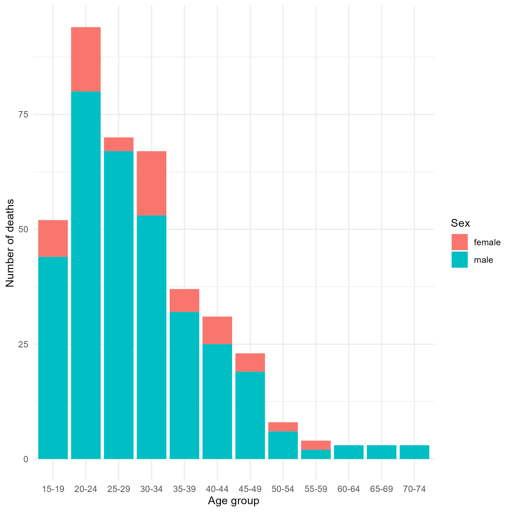

# Introduction

Welcome to your first workshop assignment! In this week's exercise, you will use your understanding of the {tidyverse} package and RMarkdown to create a short report. 

The goal of today's workshop is to reinforce your skills in **data wrangling**, **visualization**, and **reporting** using R.

**The assignment is due on Friday, October 4th, at 11:59 PM GMT.** All assignments should be submitted individually, but you are encouraged to work in groups. To submit your work, please upload your R script to the Workshop 1 submission page.

# Instructions

Below, you'll find a series of tasks that guide you through importing, cleaning, and analyzing a dataset.

These tasks should be completed in the `week_01_assignment.Rmd` file found in the `rmd` subfolder. We encourage you to have both the instructions document and the assignment document open.

You can view an example of the report you should have created by the end of today's workshop [here](https://the-graph-courses.github.io/rmc_q4_2024_materials/rmc_week_01_workshop/rmd/example_report.html).

## TASK 1: LOAD THE REQUIRED PACKAGES

Use `pacman::p_load()` to load the following packages: `{tidyverse}`, `{here}`, `{janitor}` and `{reactable}`.

## TASK 2: IMPORT THE DATA

Use `read_csv()` and `here()` to import the "motorcycle_accidents_colombia.csv" dataset from your data folder.

## TASK 3: CLEAN THE COLUMN NAMES

Some columns, including the age group column, contain spaces that make them challenging to work with in R. Use `clean_names()` from the `{janitor}` package to address this issue. Store the output as a data frame called `col_accidents_clean`.

## TASK 4: RENAME AND TRANSFORM VARIABLES

Transform the data by doing the following, and store the results as `col_accidents_clean2`:

-   Rename the `condition` to `position`. Use the `rename()` function to perform this change.
-   Change the capitalization of the gender values ("male" and "female") to title case using `mutate()` and `str_to_title()`.

## TASK 5: CREATE A SUBSET

Create a subset of your data by doing the following, and store it as `col_accidents_subset`:

-   Keep only the following columns using the `select()` function: `id`, `gender`, and `age`, `age_group`, and `position`.
-   Use the `filter()` function to exclude any rows where the `position` is listed as "unknown".

**CHECK**: Your dataset should have 395 rows and 5 columns.

## TASK 6: SUMMARIZE DATA

Using the subset created in Task 5, construct a summary table that displays the number of deaths per age group and gender.

**HINT**: Use the `count()` function from `{dplyr}`. You could also do the same thing using a combination of `group_by()` and `summarize()`, but `count()` is the more efficient option.

**CHECK**: Your summary table should have 21 rows and 3 columns. The first few rows of your summary table should look like this:

+-----------+----------+---------+
| age_group | gender   | n       |
|           |          |         |
| \<fctr\>  | \<fctr\> | \<int\> |
+:==========+:=========+========:+
| 15-19     | Female   | 8       |
+-----------+----------+---------+
| 15-19     | Male     | 44      |
+-----------+----------+---------+
| 20-24     | Female   | 14      |
+-----------+----------+---------+
| 20-24     | Male     | 80      |
+-----------+----------+---------+

## TASK 7: VISUALIZE SUMMARY DATA

Using the summary table you created in the previous step, create a stacked bar plot using `{ggplot2}` to illustrate the number of deaths per age group, segmented by sex.

**HINT**: You will need to use the `ggplot()` and `geom_col()` functions to create this plot.

## TASK 8: EXPORT YOUR OUTPUTS

Organize your outputs by creating an "outputs" folder within your project directory.

1.  Export your summary table as a CSV file.

2.  Use `ggsave()` to save your plot.

**HINT**: Save both these files to your "outputs" folder. Make sure to use the `here()` function to specify your file paths.

## TASK 9: ADD INLINE CODE AND COMMENTARY  

To finalize your report, include **inline code** in your RMD to interpret the results from your graph or table. Replace any placeholders such as `"WRITE_YOUR_INLINE_CODE_HERE"` with actual inline code to dynamically display your findings.

Quoting results with inline code can be tricky, so we've completed one answer as an example for you. Feel free to adapt this code for the remaining two answers.

## TASK 10: CREATE A DRIVER POSITION SUBSET & SUMMARY 

Create a summary table that displays the driving position of the gender and age-group with the most fatal accidents and render it using `{reactable}` in your knitted document. 

For this, use the `col_accidents_subset` by doing the following, and store it as `driver_position_subset`:

-   Use the `filter()` function to ONLY include participants that are `Male` AND `20-24`.
-  Construct a summary table that displays the number of deaths per driving position using the `count()` function from `{dplyr}`.
-   Use the `reactable()` function from `{reactable}`. 

**CHECK**: Your table should have 2 rows and 2 columns.

## TASK 11: KNIT YOUR RMARKDOWN DOCUMENT

Finally, knit your RMarkdown document to an HTML file. When you knit your file, please turn OFF code echo on all chunks, so that you have a clean output.

Inspect your final HTML to ensure all looks good before submitting.

# Submit Your Work

To submit your completed assignment, upload YOUR Rmd file to the submission page. Make sure you can knit your document successfully to HTML before uploading to avoid any submission issues.

Happy coding, and good luck!

# Challenge (Optional)

If you’re looking for an additional challenge, try the following:

1.  Add text labels to the bars in your plot, to indicate the exact number of deaths for each segment. You can use the `geom_text()` function to achieve this.

2.  Add a title, subtitle, and caption to your plot that provide context and explain the data being visualized.

3.  Create an additional plot. For example, you could add line graph or bar graph to represent a time series of the number of deaths per year. Utilize the `select()`, `filter()`, `mutate()`, and plotting functions from `{ggplot2}` to complete this task.
