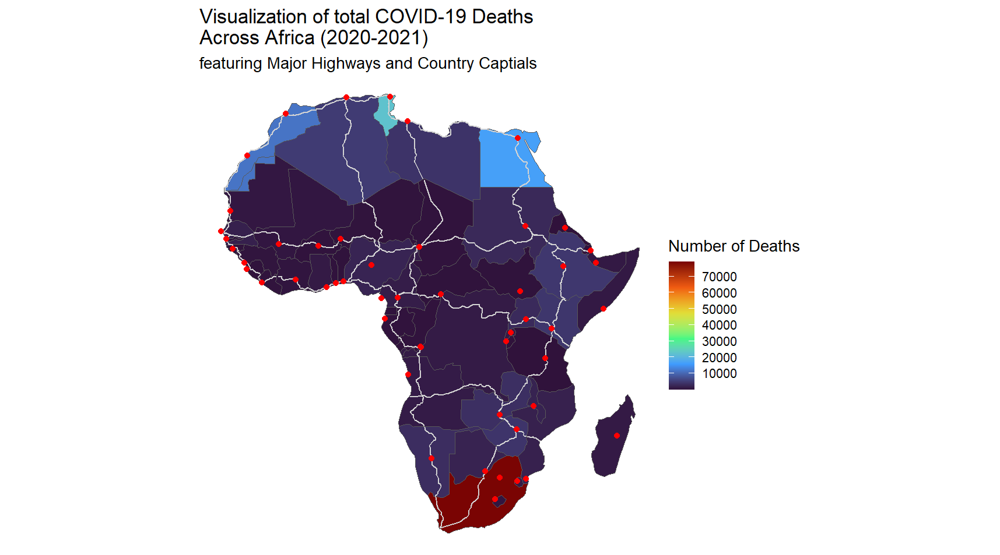

# Introduction

Welcome to the Week 8 workshop! This is the first week of our Geospatial Visualization module. We hope you have fun making maps today!

Please refer to the lesson notes to aid you in the workshop exercise:

-   [Thematic Maps](https://the-graph-courses.github.io/geospatial_viz/ls02_thematic_maps.html)
-   [Physical features](https://the-graph-courses.github.io/geospatial_viz/ls03_physical_features.html)
-   [Density Maps](https://the-graph-courses.github.io/geospatial_viz/ls04_density_map.html)

## Objective

Our goal is to create a multi-layered map of COVID-19 cases and deaths per country in Africa.

Here is an example of what your final plot could look like:



Our COVID data comes from the [COVID-19 Data Hub](https://covid19datahub.io/), which provides a daily summary of COVID-19 cases, deaths, recovered, tests, vaccinations, and hospitalizations for 230+ countries, 760+ regions, and 12000+ administrative divisions of lower level.

We will combine these case counts with spatial data from the `{afrilearndata}` package including `africountries`, `africapitals` and `afrihighway`.

# Step 1: Loading Packages

Run this code chunk to load the necessary packages for this workshop.

```{r setup-packages}
# Loading required packages using pacman for package management
if(!require('pacman')) install.packages('pacman')
pacman::p_load_gh("afrimapr/afrilearndata")
pacman::p_load(tidyverse, here, janitor)
```

# Step 2: Importing Data

## Importing Daily COVID cases and deaths by country

**Task:** Import the COVID-19 data for Africa.

```{r import-data}
# Importing and cleaning COVID-19 data for Africa
covid19_africa <- "WRITE_YOUR_CODE_HERE"
```

**CHECKPOINT:** Your loaded dataset should contain **32292 rows and 7 columns**.

# Step 3: Data Exploration and Preparation

## Exploring Data Variables

**Task:** Display the first few rows of the dataset to understand its structure.

```{r explore-data}
# Displaying the first few rows of the dataset
"WRITE_YOUR_CODE_HERE"
```

As you have probably noticed, the variable names are capitalized and do not follow the `snake_case` convention. Let's try fixing this.

## Cleaning Variable Names

**Task:** Clean your dataset by formatting the variables' names into `snake_case`.

```{r clean-data}
# Clean variable name into snake_case
covid19_africa <- "WRITE_YOUR_CODE_HERE"
```

## Understanding Data Structure

**Task:** Examine the structure of the dataset to understand the types of data it contains.

**HINT:** Use `str()` to get a summary of the data types and the number of levels for factor variables.

```{r data-structure}
# Examining the structure of the dataset
"WRITE_YOUR_CODE_HERE"
```

**NOTE:**

-   There are 54 countries represented by `iso` codes and `country`.

-   The dataset includes key COVID-19 measures such as reported cases (`infected`), recoveries (`recovered`), and deaths (`death`).

The variables `iso`, `country` and `region` are currently stored as characters. However, in order to properly use them and create our choropleth maps, we will need to convert them into factors.

**Task:** Convert the `iso`, `country` and `region` variables into factors for proper usage.

**HINT:** Use the `mutate_if()` function to convert **ALL** character variables into **factors**.

```{r factorize-data}
# Convert character variables into factors
covid19_africa <- "WRITE_YOUR_CODE_HERE"
```

## Summary Statistics

Let's observe the statistics of the cleaned dataset!

```{r}
# Observe the range of dates covered by the data
summary(covid19_africa)
```

The linelist dates go from January 2020 to August 2021.

# Step 5: Loading Spatial Data

Now that we have imported and prepared our COVID-19 data, let's import our spatial data for mapping!

## Importing African Country Boundaries

**Task:** Load the spatial data for African countries from the `africountries` dataset.

```{r load-spatial}
# Loading spatial data for African countries
data(africountries)
```

## Visualizing Boundaries

**Task:** Create a simple map to visualize the country boundaries.

**HINT:** Use `geom_sf()` to plot spatial data.

```{r view-boundaries}
# Plotting the boundaries to visualize the spatial data
"WRITE_YOUR_CODE_HERE"
```

**CHECKPOINT:** Ensure that the map correctly displays all African countries' boundaries.

# Step 6: Data Manipulation

## Cleaning and Matching Data

Before we can integrate the spatial and linelist data, we need to ensure the country codes match in both datasets.

We have boundaries for 54 countries. Each country in `africountries`, should match the countries in `covid19_africa`.

### Matching Country Codes

**Task:** Identify and address any mismatches in country codes between the spatial data and COVID-19 data.

**HINT:** Use `setdiff()` to find codes in `africountries` that are not in `covid19_africa`.

```{r match-codes}
# Identifying country codes in the spatial data that do not match the COVID data
setdiff("WRITE_YOUR_CODE_HERE")
```

**CHECKPOINT:** The ISO code `ESH` is not found in `covid_africa`. In addition, we have a NA value.

### Resolving Mismatched ISO Codes

Let's identify the countries with mismatched ISO codes by filtering for ISO code `ESH` and for NAs.

```{r resolve-mismatch}
# Filter the data
africountries %>%
  dplyr::select(iso_a3, name, name_long) %>%
  filter(iso_a3 %in% c("ESH") |
         is.na(iso_a3))
```

The two countries are:

1)  **Western Sahara**, which is often considered part of Morocco (ISO code "MAR").
2)  **Somaliland**, which is formally recognised as part of Somalia (ISO code "SOM").

**Task:** Correct the mismatched ISO codes for consistency.

```{r resolve-mismatch}
# Update ISO codes in the spatial dataset
africountries_renamed <- africountries %>% 
  mutate(
    iso_a3 = case_when(
      "WRITE_YOUR_CODE_HERE"
    )
  )
```

**CHECKPOINT:** Verify that there are no mismatches between the `africountries` and `covid19_africa` datasets by running the code chunk below:

```{r}
# Verifying that all codes now match
setdiff(africountries_renamed$iso_a3,
        covid19_africa$iso)
```

Next, let's check if there are any countries in the COVID dataset that lack a corresponding polygon in the spatial dataset.

**Task:** Identify and address any mismatches in country codes between the COVID-19 data and spatial data.

**HINT:** Use `setdiff()` to find codes in `covid19_africa` that are not in `africountries`.

```{r}
"WRITE_YOUR_CODE_HERE"
```

**CHECKPOINT:** Five countries do not match. These are five small island countries off the coast of the mainland map. Therefore, they are excluded from our geospatial visualizations.

## Aggregating Case Data

### Summarizing COVID-19 Cases

To simplify our map, we'll aggregate the daily COVID-19 case data by country.

**Task:** Aggregate the daily COVID-19 case data by country.

**HINT:** Use `group_by()` and `summarise()` to calculate **total cases**.

```{r summarize-cases}
# Summarizing total cases by country
covid19_afr_inf <- 
  covid19_africa %>% 
  "WRITE_YOUR_CODE_HERE"

covid19_afr_inf
```

**CHECKPOINT:** Your dataset should contain **54 rows and 3 columns**.

### Integrating Spatial and Case Data

Now that we have aggregated the daily COVID-19 cases and created a summary table for total cases per country, let's combine the spatial and case data to prepare for mapping.

**Task:** Join the spatial and COVID-19 case data to prepare for mapping.

**HINT:** Use the correct joining function to combine the summarized case data to the spatial data.

```{r integrate-data}
# Joining spatial data and summarized case data
covid19_afr_inf_spatial <- 
  left_join("WRITE_YOUR_CODE_HERE")
```

**CHECKPOINT:** Your dataset should contain **51 rows and 14 columns**.

# Step 7: Simple Visualization

With data cleaning out of the way, we can now proceed to create our maps. Let's go ahead and create them!

## Mapping Total COVID-19 Cases

**Task:** Create a choropleth map to visualize the total number of COVID-19 cases by country.

```{r map-cases}
# Creating a choropleth map using ggplot2
total_cases_plot <- "WRITE_YOUR_CODE_HERE"
```

**CHECKPOINT:** Verify that the map correctly visualizes the total cases by shading the countries according to their case counts.

# Step 8: Mapping Physical Features and Population Data

While we created a choropleth map showing the total COVID-19 cases in Africa, confirmed case numbers are often underreported due to factors like limited testing, reporting delays, and unequal access to healthcare. A more reliable metric for assessing the outbreak might be the number of reported deaths.

Let's go ahead and create a map showcasing the total COVID-19 deaths per country in Africa!

## Preparing Death Data

**Task:** Summarize the total deaths per country for mapping.

**HINT:** Repeat the steps used for summarizing total cases.

```{r summarize-deaths}
# Summarizing total deaths by country
covid19_afr_dth <- 
"WRITE_YOUR_CODE_HERE"
```

**CHECKPOINT:** Ensure the summarized dataset contains the total deaths for each country. Your dataset should contain **54 rows and 3 columns**.

## Integrating Death Data with Spatial Data

**Task:** Join the summarized death data with the spatial dataset.

```{r integrate-death-data}
# Combining spatial data with summarized death data
covid19_afr_dths_spatial <- 
  left_join("WRITE_YOUR_CODE_HERE")
```

**CHECKPOINT:** Verify that the dataset is correctly joined and ready for visualization. Your dataset should have **51 rows and 14 columns**.

## Mapping Total COVID-19 Deaths

**Task:** Create a choropleth map showing the total COVID-19 deaths by country.

```{r}
# Create choropleth map of total deaths by country
total_deaths_plot <- "WRITE_YOUR_CODE_HERE"
```

## Advanced Geospatial Visualization

Now, we'll enhance our map by adding layers for highways and capital city populations.

Let's add two layers:

1.  African trans-continental highway network lines, available in the `afrihighway` dataset.

2.  Dot map with the population in the capital cities of Africa, from the `africapitals` dataset.

**Task:** Add additional layers for highways and capital city populations to the **total deaths** map.

**HINT:** Use `geom_sf()` for highways and `gemo_sf(... aes(geometry = ...))` for capitals. Customize the map using different color scales and themes. For the provided example, we used the color scale `scale_fill_viridis_c(option = "H")` and theme `theme_void()`.

```{r advanced-visualization}
# Adding highway and capital city layers
"WRITE_YOUR_CODE_HERE"
```

**CHECKPOINT:** Check that both the highways and capitals are accurately displayed on the map.

# Challenge (OPTIONAL)

# Challenge Question 1: Per Capita Cases

Create a choropleth map showing the COVID-19 cases per capita for each African country.

**HINT:** Look for some up-to-date population data and import it into your RStudio to use for your per capita calculations.

```{r}
"WRITE_YOUR_CODE_HERE"
```

## Challenge 2: Joining & Filtering

Create a choropleth map showing the per capita COVID-19 cases OR deaths for only the countries in **Western Africa**.

Create simple map

```{r}
"WRITE_YOUR_CODE_HERE"
```
