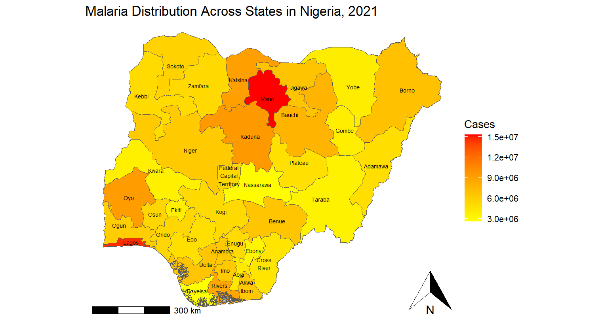
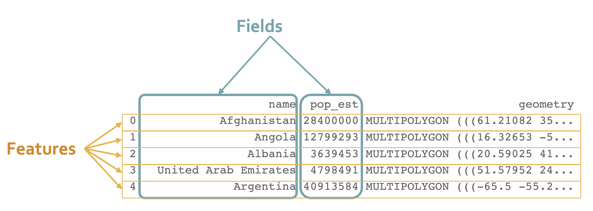

# Introduction

Welcome to the Week 9 workshop! This is the second and final week of our Geospatial Visualization module, where you'll practice making advanced visualizations.

In this workshop, we’ll be using a choropleth map to visualize the distribution of malaria cases across the 37 different states of Nigeria for the year 2021. We will then add a layer of state names onto the map with `geom_sf_text()`.

By the end of today's workshop, you should have created a choropleth map similar to the one below:



**Please refer to the lesson notes** to aid you in the workshop exercise:

-   [Shapefile Data](https://the-graph-courses.github.io/geospatial_viz/ls05_shapefile_data.html)
-   [Boundary Data](https://the-graph-courses.github.io/geospatial_viz/ls07_boundary_data.html)
-   [Layers](https://the-graph-courses.github.io/geospatial_viz/ls10_layers.html)

# Step 1: Load Packages

Let's start by loading our needed packages.

Run this code chunk to load the necessary packages for this workshop.

```{r}
if(!require('pacman')) install.packages('pacman')

pacman::p_load(ggspatial, # map annotations
               tidyverse, # wrangling and visualization
               janitor,   # clean names
               here,      # project-relative file paths
               sf)        # spatial data
```

# Step 2: Data Preparation

Before creating a choropleth map, it is essential to prepare the data. The data should contain the **geographic regions** and the **values** you want to visualize.

In this section, you will go through the data preparation process, which includes the following steps:

1.  **Import polygon data**: This is the geographical data that contains the boundaries of each region that you want to include in your map. Also known as **features** or **geometries**.

2.  **Import attribute data**: This is the data that contains the values you want to visualize on the map, such as disease incidence, population density, etc. Also known as **fields**.

3.  **Join the polygon and attribute data**: This step involves merging the polygon data with the attribute data based on a common identifier, such as the administrative level or region name. This will create a single dataset that contains both the geographic boundaries and the corresponding data values.



## Step 2.1: Import Polygon Data \| State Boundaries

The geographical shapefile data for Nigeria’s administrative boundaries (like states or provinces) is available inside your data folder. These data were extracted from the GADM database (www.gadm.org).

Find the shapefile for state boundaries (ADM1) called `NGA_adm1.shp` inside the `data/NGA_adm_shapefile/` folder.

**TASK:** Read the shapefile using the `{sf}` package and store it as an object called `nga_adm1`.

**HINT:** Use the `here()` function for relative file paths.

```{r}
# Read the shapefile for state boundaries
nga_adm1 <- "WRITE_YOUR_CODE_HERE" %>% 
  clean_names()
```

**CHECKPOINT:** You should see that the `nga_adm1` has 38 features (polygons), 9 fields (attributes), and 1 geometry list-column. Note that state names are recorded in the `name_1` column.

Check that the output is an `sf` object and can be plotted using `geom_sf()`:

```{r}
# Check class
class(nga_adm1)
```

The object falls under several classes, but the important thing is that "sf" is one of them.

Let's make sure we can properly plot the boundaries of Nigeria!

**TASK:** Create a simple map plotting the state boundaries of Nigeria.

```{r}
# Plot boundaries
"WRITE_YOUR_CODE_HERE"
```

You should now have a simple plot of state boundaries.

## Step 2.2: Import Attribute Data of  Malaria Cases

Since our ultimate goal is to color or shade each state based on the number of malaria cases, we need to add case count data as an *attribute*.

Our next dataset records the number of malaria cases reported in each state of Nigeria for the years 2000, 2006, 2010, 2015, and 2021.

**TASK:** Load the malaria dataset located in your `data` folder called `malaria.csv`.

**HINT:** Use the `here()` function for relative file paths.

```{r}
# Read in the attribute data for case counts
malaria_cases <- "WRITE_YOUR_CODE_HERE"
```

**CHECKPOINT:** Your data frame should have 37 rows and 6 columns.

Let's take a look at the data variables.

```{r}
# Inspect data frame
glimpse(malaria_cases)
```

**NOTE:** The state names are recorded in the `state_name` column.

## Step 2.3: Join Polygon and Attribute Data by State Names

In order to properly graph the malaria cases by states in Nigeria, we need to join the polygon and attribute data.

**TASK:** Merge the shapefile data `nga_adm1` with `malaria_cases` data to create a new `sf` data frame called `nga_malaria` containing **ONLY** the state data.

**HINT:** Use the `by` argument to specify a character vector of variables to join by.

```{r}
# Join the two datasets by state name
nga_malaria <- "WRITE_YOUR_CODE_HERE"
```

**CHECKPOINT:** `nga_malaria` should have 37 rows of 15 variables.

Let's create a smaller and more useful dataset that contains variables that will be used in the plots.

**TASK:** Select the columns containing the state names, the columns containing the cases, and the column containing the geometry from `nga_malaria`. Rename the `name_1` with `state_name`

```{r}
# Subset data to relevant variables
nga_mal_adm1 <- "WRITE_YOUR_CODE_HERE"
```

**CHECKPOINT:** `nga_mal_adm1` should have 37 rows and 7 columns.

Let's make sure that our newly created data frame is still an `sf` object.

```{r}
class(nga_mal_adm1)
```

Great! Now that we've merged the polygons with our desired attribute data, let's get to mapping.

# Step 3: Creating a Choropleth Map with `{ggplot2}`

## Filling by Attribute Variable

**TASK:** First, use `nga_mal_adm1` data and the `geom_sf()` function to plot state boundaries, and set the `fill` aesthetic to vary by the number of malaria cases for 2021 (`cases_2021`) of each state.

**HINT:** Think carefully about the syntax of `{ggplot2}` and determine whether the `fill` aesthetic should be placed inside `aes()` or outside.

```{r}
# Create choropleth map
"WRITE_YOUR_CODE_HERE"
```

Next, expand on your previous code above to:

1.  Add an informative title to your plot

2.  Edit the legend title to say "Estimated cases"

3.  Remove distracting background elements with `theme_void()`

**TASK:** Create a customized choropleth map containing the 3 main points above.

```{r}
# Customize title and theme
"WRITE_YOUR_CODE_HERE"
```

## Customizing the Map

Customize the map by adding:

1.  A north arrow on the bottom right with `ggspatial::annotation_north_arrow()`

2.  A scale bar on the bottom left with `ggspatial::annotation_scale()`

**TASK:** Create a customized choropleth map containing the 2 main points above.

```{r}
# Add north arrow and scale bar
"WRITE_YOUR_CODE_HERE"
```

**NOTE:** In the Rmd preview window, the scale bar may overlap with the map, which is undesirable. However, if you zoom out on the plot, you will see that it no longer overlaps.

## Labeling the Map with State Names

The `geom_sf_text()` function adds text labels to each polygon, automatically positioning the text at the polygon’s centroid. We haven't covered this exact function in the prework, but it is very similar to the `geom_sf_text_repel()` function from the Layers lesson.

**TASK:** Build on your previous code to add a new layer of `state_name` labels with `geom_sf_text()`.

Additionally:

1.  Use `str_wrap()` with a `width` of 7 to wrap text in `state_name`

2.  Change the `color` of the text to `"white"` or `"black"`

3.  Set the `size` of text to `1.5`

```{r}
# Add the name of each state to its centroid
"WRITE_YOUR_CODE_HERE"
```

## Faceting the Map by Year

Now that you have learned how to create a layered choropleth map, let's take it a step further by visualizing how malaria cases have changed over time. We will use faceting to create multiple panels in a single plot, each showing the distribution of malaria cases for different years.

### Pivot the Data to Long Format

Before we can create faceted maps, we need to reshape the dataset from a wide format to a long format, where each row represents a single case count for a specific state and year. This will make it easier to facet the maps by year.

**TASK:** Use the `pivot_longer()` function from the `{tidyverse}` package to convert the dataset into a long format.

**HINT:** Use `pivot_longer()` to change the dataset structure. The columns representing cases for each year (`cases_2000`, `cases_2006`, `cases_2010`, `cases_2015`, `cases_2021`) should be transformed into two columns: one for `year` and one for `cases`.

```{r}
# Reshape data to long format
nga_mal_adm1_long <- "WRITE_YOUR_CODE_HERE"
```

**CHECKPOINT:** After pivoting, your dataset should have two new columns: `year` and `cases`. Verify that `nga_mal_adm1_long` has 185 rows and 4 columns.

### Create a Faceted Map

Now that you have the data in the correct long format, the next step is to create a faceted map to visualize malaria cases by state for each year.

**TASK:** Use `ggplot2` to create a faceted map with panels for each year.

**HINT:** Use `facet_wrap()` to create separate panels for each year in the dataset.

```{r}
# Plot faceted map
"WRITE_YOUR_CODE_HERE"
```

**CHECKPOINT:** Ensure that your faceted map shows a separate panel for each year with accurate malaria cases per state. Each panel should represent one of the years (2000, 2006, 2010, 2015, 2021), displaying how malaria cases have changed over time across Nigerian states.

By visualizing this way, you'll gain insights into the temporal trends and spatial patterns of malaria prevalence in Nigeria.

# Submission

Once you have finished the tasks above, you should save your answers and upload your assignment Rmd on the workshop webpage. You should upload just one Rmd file with your answers (do not upload a zipped folder). Make sure to include your name in the YAML header at the top of the script.

Keep up the great work!

# Challenge (Optional)

## Automate Mapping of Malaria Cases Across Nigerian States for Each Year

To automate the visualization of malaria cases across Nigerian states for each year, we will create a function in R that dynamically generates a map for each year in the dataset. By using this approach, we can efficiently generate multiple plots and analyze the spatial distribution of malaria cases over time.

For this challenge, you will develop a function that loops through each year in the dataset, creates a map for each year, and displays these maps. This approach allows you to automate the repetitive task of plotting multiple maps and ensures consistency across all visualizations.

**TASK:** Create a function that generates a map for each year using `ggplot2` and `sf`, and use a loop to display maps for all years in your dataset.

**HINTS:** 
-     Use `unique()` to extract all unique years from the dataset. 
-     Use a `for` loop to iterate through each year and filter the dataset for that year. - Ensure that the color scale for malaria cases remains consistent across all maps by setting the scale limits.

```{r}
# Function to automate mapping per year
"WRITE_YOUR_CODE_HERE"
```

## Create an Animated Map of Malaria Cases Over Time

To create an animated map that shows the progression of malaria cases from 2000 to 2021, we can use the `gganimate` package in R. This package extends `ggplot2` to add animations, making it perfect for visualizing changes over time.

For this challenge, you'll create an animated map that shows the changes in malaria cases across Nigerian states from the year 2000 to 2021. This animation will help visualize the temporal trends of malaria cases, providing a dynamic view of how the disease has spread or receded over the years.

**TASK:** Create a `ggplot` object similar to your faceted plot, but instead of faceting by year, use `transition_states()` from `gganimate` to animate through the years.

**HINTS:** Use `transition_states()` from `gganimate` to create an animation over the `year` variable. For this animation, we recommend you to not include the state's name in your graph.

```{r}
"WRITE_YOUR_CODE_HERE"
```

### Additional Tips:

-   Experiment with different color scales and themes to improve the visualization.
-   Consider adding more annotations or adjusting the `ease_aes` parameter to create different animation effects.
